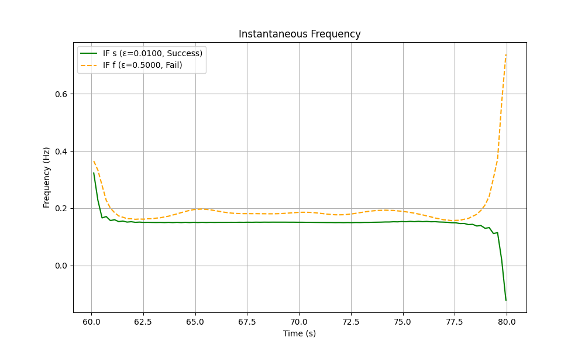
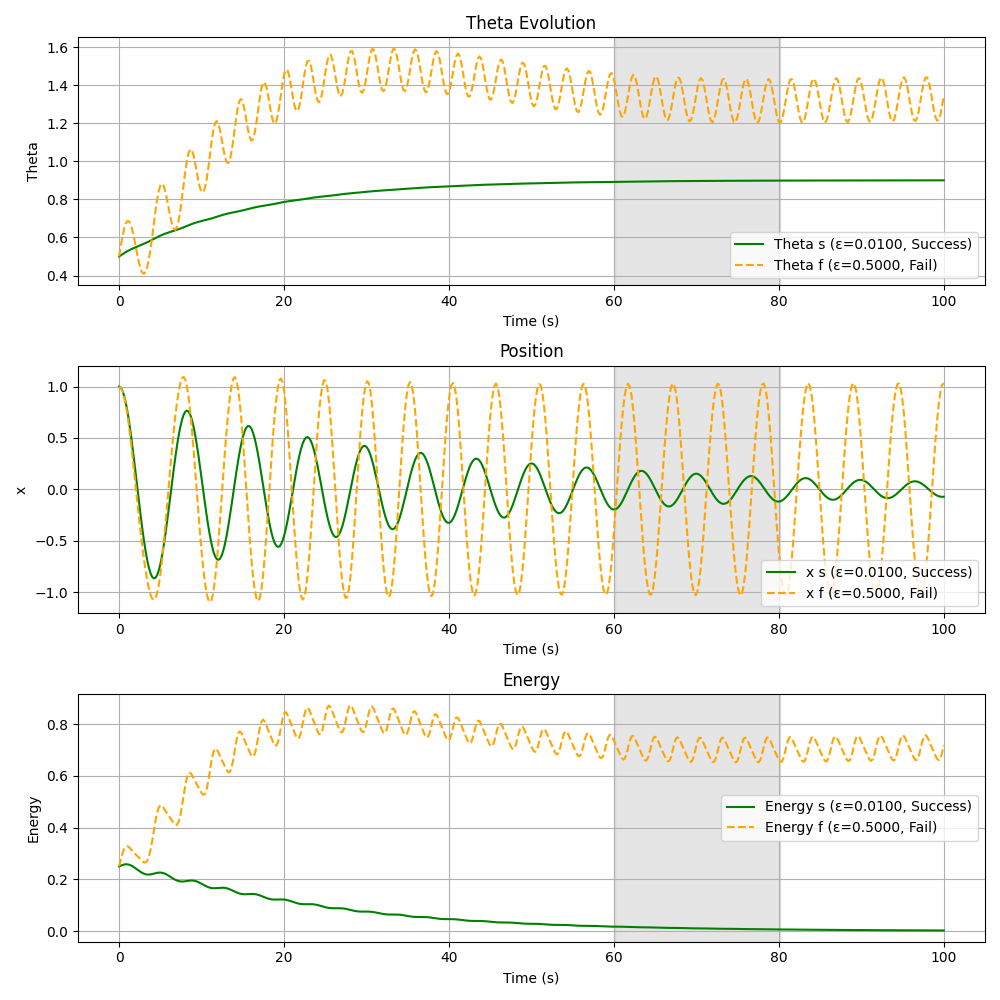
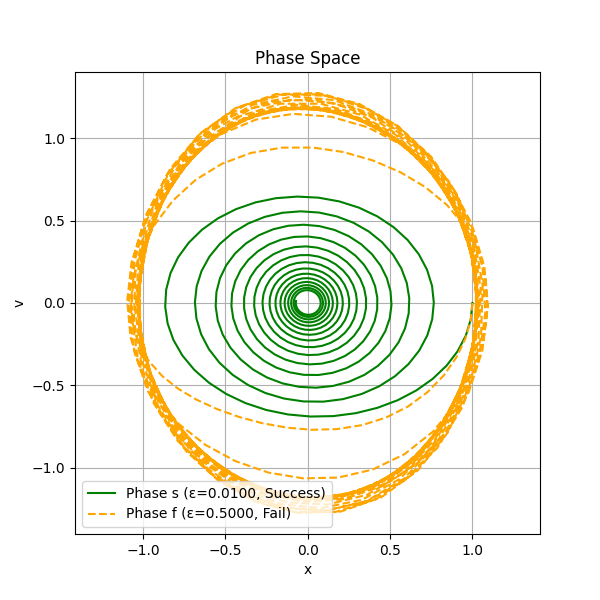

# Modeling Self-Regulating Systems: A Study in Adaptive Physics

## What?

This simulation models a damped harmonic oscillator where a key physical parameter, the restoring force constant (represented by $\theta$), dynamically adapts its value. The system demonstrates how a feedback loop's rate of change impacts overall stability.

## How?

The simulation uses a set of ordinary differential equations (ODEs) solved numerically with `odeint` or `solve_ivp` from `scipy`. The system’s behavior is governed by three interconnected variables:

- **Position ($x$) and velocity ($v$):** fast-evolving state of the oscillator.  
- **Theta ($\theta$):** adaptive parameter that changes slowly based on feedback from the system's energy, mimicking an adaptive rule.

The ODEs are defined as:

$$\dot{x} = v$$  
(Velocity is the rate of change of position)

$$\dot{v} = -\theta x - \delta v$$  
(Damping and restoring force, where $\theta$ is adaptive stiffness)

$$\dot{\theta} = \epsilon (x^2 - a) - \gamma (\theta - \theta_0)$$  
(Feedback-driven adaptation, with $x^2$ as a proxy for energy)

Two cases are simulated with configurable adaptation rates (`epsilon_success` and `epsilon_fail`), allowing flexible testing of slow and fast adaptation scenarios.

- **Default slow rate:** $\epsilon = 0.01$ (success)  
- **Default fast rate:** $\epsilon = 0.5$ (failure)  

For large $\epsilon$ (e.g., $\epsilon > 0.1$), `solve_ivp` with the `'BDF'` method is used to ensure numerical stability, with tight tolerances (`rtol=1e-6`, `atol=1e-8`).

### Numerical Integration

- The `odeint` function uses an adaptive Runge-Kutta method (LSODA) for $\epsilon \leq 0.1$.  
- For $\epsilon > 0.1$, `solve_ivp` with the `'BDF'` method is used to handle stiff dynamics.  
- Both solvers use `rtol=1e-6` and `atol=1e-8` to ensure numerical accuracy, particularly for higher frequencies or fast adaptation.

### Instantaneous Frequency Calculation

The instantaneous frequency of $x(t)$ is computed using:

1. **Hilbert transform** (`scipy.signal.hilbert`) to obtain the analytic signal.  
2. **Phase unwrapping and numerical differentiation** using `np.gradient`.

The instantaneous frequency is:

$$f_{\text{inst}} = \frac{1}{2\pi} \frac{d\phi_{\text{unwrap}}}{dt}$$

- `np.gradient` provides central differences for numerical stability.  
- The time window ($t \in [60, 80]$) focuses on steady-state behavior.  
- For rapidly changing signals (large $\epsilon$, e.g., 0.5), the narrowband assumption of the Hilbert transform may introduce minor inaccuracies, triggering a warning.
- Practical note: edge artefacts in the Hilbert transform.
Even when focusing on a steady-state window (e.g., 60–80 s), the Hilbert transform can exhibit edge artefacts near the boundaries of the chosen segment due to the implicit periodic extension in FFT-based implementations. This is not mitigated in this simulation.

The damped theoretical frequency is calculated based on the steady-state $\theta$:

$$f_d = \frac{\sqrt{\theta_{\text{mean}} - \frac{\delta^2}{4}}}{2\pi}$$

This is reported alongside the observed frequency to validate the simulation’s physical behavior.

## Why?

The simulation demonstrates a key principle of adaptive systems: **adaptation rate is critical for stability.**

- **Slow adaptation** ($\epsilon$ small): smooth convergence to a stable state.  
- **Fast adaptation** ($\epsilon$ large): overshoot and unstable, sustained oscillations.  

---

## Explanation of Parameters

| Parameter | Value | Description |
|-----------|-------|-------------|
| $\delta$ | 0.05 | Damping coefficient controlling energy loss |
| $a$ | 0.5 | Target amplitude squared for $x$ |
| $\gamma$ | 0.05 | Regularization strength pulling $\theta$ toward $\theta_0$ |
| $\theta_0$ | 1.0 | Baseline reference for $\theta$ (natural frequency squared) |
| $\epsilon$ | 0.01 (success), 0.5 (fail) | Adaptation rate |
| $t$ | 0–100, 500 points | Time array for simulation |
| Initial conditions | $x=1.0$, $v=0.0$, $\theta=0.5$ | Starting state |
| Analysis window | 60–80 s | Time window for steady-state analysis |
| $\theta_{\text{tol}}$ | 0.01 | Threshold for $\theta$ stability (success if $\text{std}(\theta) < 0.01$) |

For higher $\theta_0$ (e.g., 2.0), $\gamma = 0.1$ stabilizes slow adaptation by reducing $\theta$ fluctuations.

---

## Behavior & Outputs

The simulation generates three plots:

1. **Stacked plot:** $\theta$, $x$, and energy over time, with the 60–80s analysis window shaded.  
2. **Phase space plot:** $x$ vs $v$.  
3. **Instantaneous frequency plot:** Frequency over the 60–80s window.  

Console output includes:

- Status (Success/Fail based on $\text{std}(\theta) < 0.01$).  
- Mean $\theta$, standard deviation of $\theta$, observed frequency (from Hilbert transform), and damped theoretical frequency.  

### Case 1: Slow Adaptation ($\epsilon = 0.01$, Success)

**Behavior:**

- $\theta$ increases gradually and converges near 0.8962.  
- $x$ shows damped oscillations, shrinking to a stable low-amplitude oscillatory state.  

**Energy:**

$$E = \frac{1}{2}v^2 + \frac{1}{2}\theta x^2$$

Heuristic energy decays and flattens, confirming convergence.

**Console Outputs:**

- Mean $\theta \approx 0.8962$, $\text{std}(\theta) < 0.01$  
- Observed frequency $\approx 0.1482$ Hz  
- Damped theoretical frequency $\approx 0.1506$ Hz based on $\sqrt{0.8962 - \frac{0.05^2}{4}} / (2\pi)$  
- Phase space: smooth inward spiral toward a stable limit cycle  

*Adjust `epsilon_success` in code to explore different slow adaptation rates.*

### Case 2: Fast Adaptation ($\epsilon = 0.5$, Fail)

**Behavior:**

- $\theta$ oscillates persistently, failing to settle.  
- $x$ exhibits large, repeating oscillations.  

**Energy:**

- Heuristic energy oscillates at a higher mean level, reflecting non-convergence.  

**Console Outputs:**

- Mean $\theta \approx$ 1.3244, $\text{std}(\theta) > 0.01$  
- Observed frequency ~0.1979 Hz  
- Damped theoretical frequency depends on mean $\theta$ but is less reliable due to instability  
- Phase space: sustained wide loops, no contraction toward equilibrium  

*The console reports single mean values for (theta) and frequency, but plots show oscillatory behavior due to non-convergence. Adjust epsilon_fail to test different fast adaptation rates.*

---

## Interpretation

- **Small $\epsilon$ (slow adaptation)** → stable self-regulation  
- **Large $\epsilon$ (fast adaptation)** → unstable divergence  

---

## Stability Analysis

The adaptive oscillator admits equilibrium solutions analyzed using fixed-point and linear stability methods.

### Equilibrium Conditions

At equilibrium:

$$\dot{x} = 0, \quad \dot{v} = 0, \quad \dot{\theta} = 0$$

Gives:

$$x^* = 0, \quad v^* = 0$$

From $\theta$-dynamics:

$$\epsilon \big( (x^*)^2 - a \big) - \gamma (\theta^* - \theta_0) = 0$$

So:

$$\theta^* = \theta_0 - \frac{\epsilon}{\gamma} a$$

In practice, $x$ oscillates around 0, so $\langle x^2 \rangle \approx a$, and $\theta$ converges toward a bounded value near $\theta_0$.

### Linearization

Jacobian at $(x^*, v^*, \theta^*)$:

$$
J = \begin{bmatrix}
0 & 1 & 0 \\
-\theta^* & -\delta & -x^* \\
2\epsilon x^* & 0 & -\gamma
\end{bmatrix}
$$

At $(x^*, v^*) = (0, 0)$:

$$
J = \begin{bmatrix}
0 & 1 & 0 \\
-\theta^* & -\delta & 0 \\
0 & 0 & -\gamma
\end{bmatrix}
$$

Eigenvalues:

$$\lambda_{1,2} = \frac{-\delta \pm \sqrt{\delta^2 - 4\theta^*}}{2}, \quad \lambda_3 = -\gamma$$

### Stability Condition

- $\delta > 0$ and $\gamma > 0$  
- Stability depends on $\theta^* > 0$  
- Small $\epsilon$ → $\theta$ close to equilibrium → stable  
- Large $\epsilon$ → $\theta$ oscillates → unstable  

---

## Key Takeaways

- Analytical stability requires **positive $\theta$** and **moderate adaptation rate**.  
- **Slow adaptation ($\epsilon$ small)** → stable self-regulation.  
- **Fast adaptation ($\epsilon$ large)** → oscillatory divergence.  
- Higher $\theta_0$ (e.g., 2.0) requires increased $\gamma$ (e.g., 0.1) to stabilize slow adaptation by reducing $\theta$ variability.
